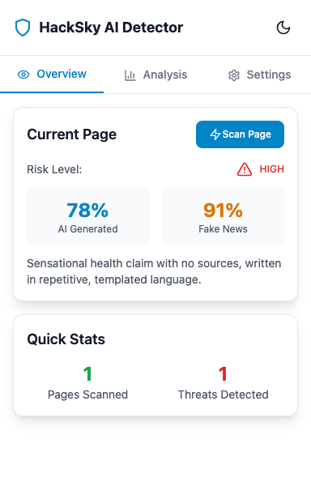
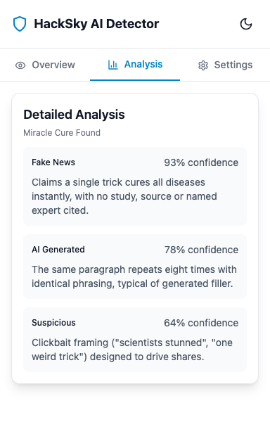
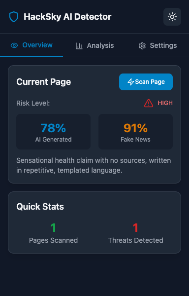
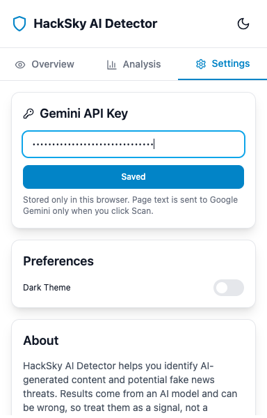
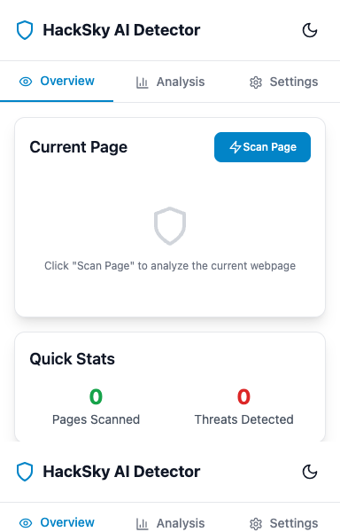

# SafeClick

A Chrome extension that flags AI-generated content, misinformation and scam patterns on the page you're reading. Click **Scan Page** and SafeClick sends the page's visible text to Google Gemini, then shows an AI-content score, a fake-news score, an overall risk level and specific findings.

<p align="center">
  
  
  
</p>

<p align="center"><sub>Example output on a test article. Scores come from an AI model and can be wrong; treat them as a signal, not a verdict.</sub></p>

## Quick start

```bash
cd hacksky1
npm install
npm run build
```

1. Open `chrome://extensions`, turn on **Developer mode**, click **Load unpacked** and pick `hacksky1/dist`.
2. Get a free Gemini API key at [aistudio.google.com/apikey](https://aistudio.google.com/apikey).
3. Open the extension, go to **Settings**, paste the key and click **Save Key**.
4. Open any article and click **Scan Page**.

<p align="center">
  
  
</p>

## Privacy

- Reads a page only when you click **Scan Page** (`activeTab`). Nothing runs in the background on the sites you visit.
- Never modifies the page it scans.
- Sends only the page's visible text (up to 15,000 characters) to Google Gemini.
- Your API key stays in your browser's extension storage.

## Repo layout

| Path | What it is |
|---|---|
| [`hacksky1/`](hacksky1) | The extension (React + TypeScript + Tailwind, built with Vite). See its [README](hacksky1/README.md). |
| [`hacksky1/demo.html`](hacksky1/demo.html) | A sample page to try scans on. |
| [`docs/screenshots/`](docs/screenshots) | Screenshots used in this README. |

## License

MIT, see [LICENSE](LICENSE).
